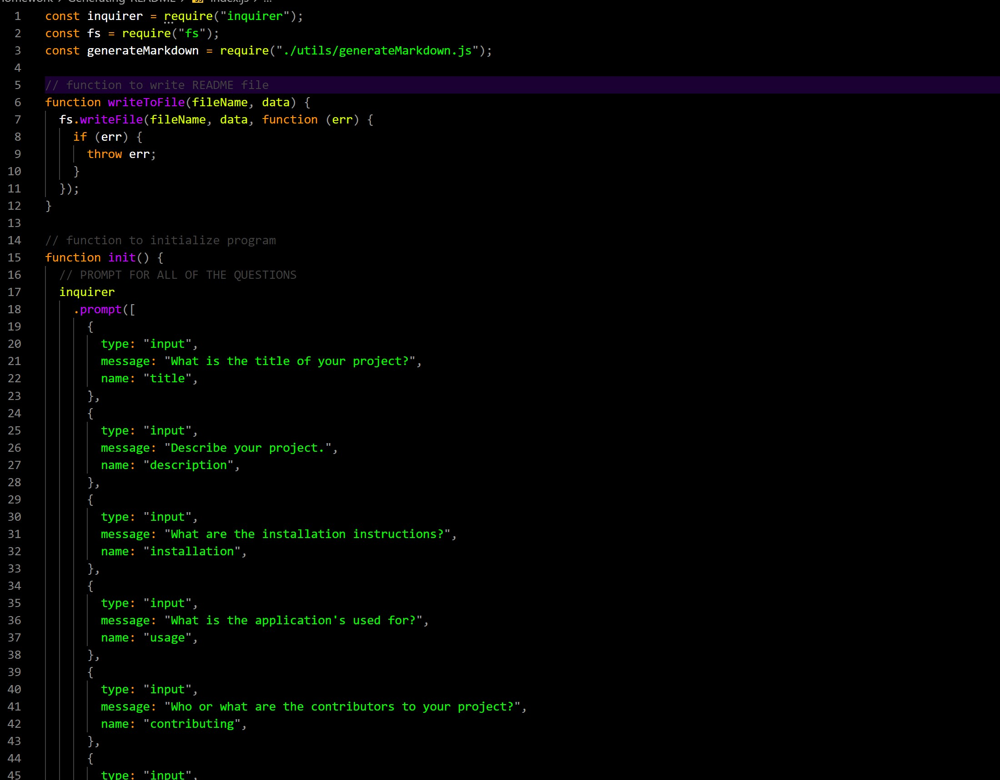
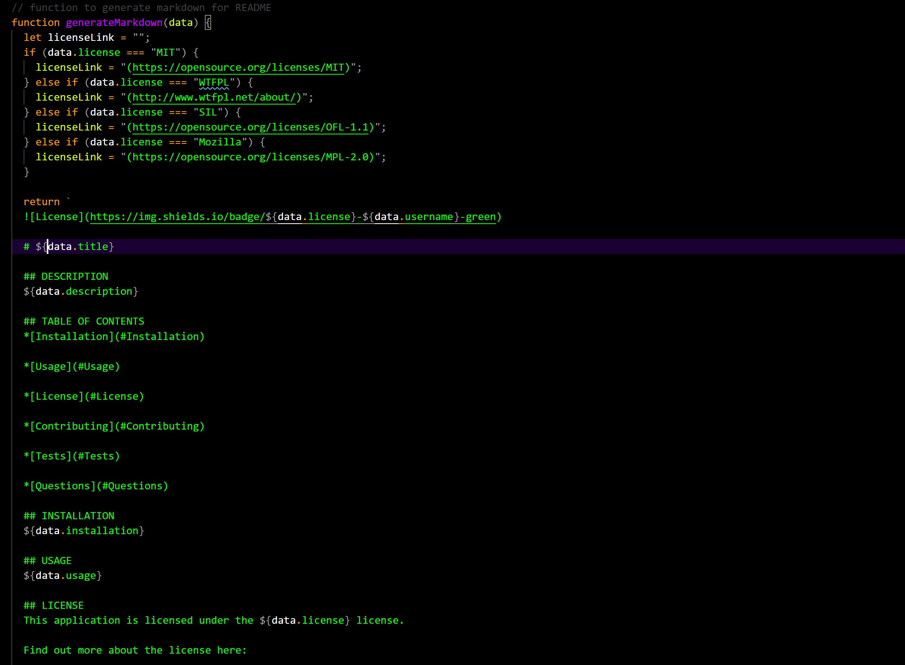
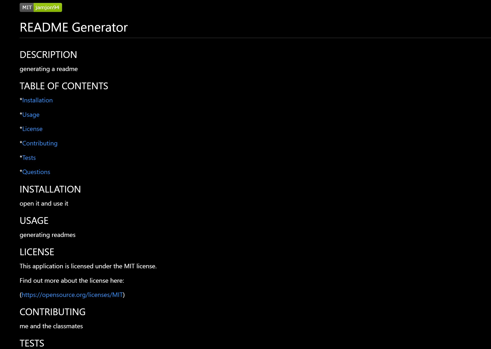

# README Generator

## DESCRIPTION

This is a README generator made to make your life _just_ that much simpler! Get rid of the hassle of having to make a new README.md from scratch every time you start a new project by using this Generator! Even _this_ README was done by the generator! With its help, you will no longer be under the stress of last minute writing out a README and wondering if it's good enough!

## TABLE OF CONTENTS

\*[Installation](#Installation)

\*[Usage](#Usage)

\*[License](#License)

\*[Contributing](#Contributing)

\*[Tests](#Tests)

\*[Questions](#Questions)

## LAYOUT

Here's what the application looks like!

## INSTALLATION

Just open it up, type in "node index.js" and it will begin the process of creating an awesome README for you!

## USAGE

As the title says, this is a README generator that will generate the prompts that you need to fill out in order to have a complete README.md

## LICENSE

This application is licensed under the MIT license.

Find out more about the license here:

(https://opensource.org/licenses/MIT)

## CONTRIBUTING

I want to thank the other classmates from the Boot Camp, who once again, as we always do, came together to work as a team, answer questions anyone else had, and helped however they could!

## TESTS

It's simple. Once you open it up, it will prompt you with questions that you only need to answer until the very end. After that, it will generate the README and create a Markdown file for you!

## QUESTIONS

For any questions, contact me:

Github: https://www.github.com/jamjon94

email: jamie.mar.jones14@gmail.com
